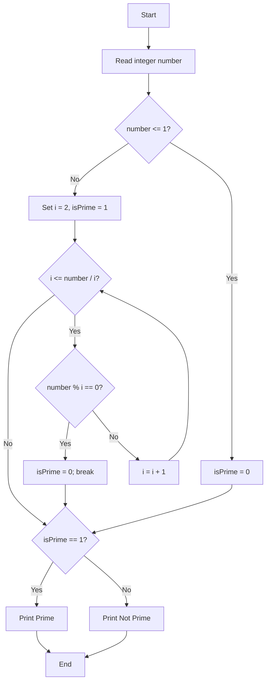
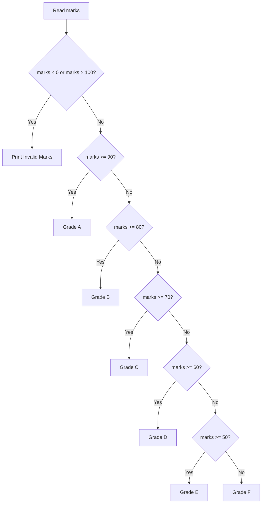
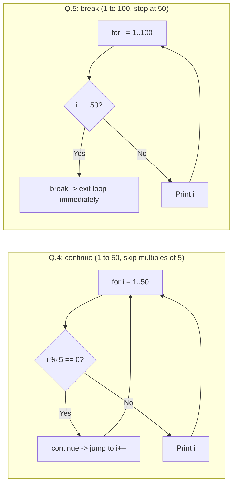

# Control Flow Diagrams (Labs 1–3)

## 1. Prime Number Check (Lab 1 — Program 1 / Q.1)

```mermaid
flowchart TD
    A["Start"] --> B["Read integer number"]
    B --> C{"number <= 1?"}
    C -- Yes --> D["isPrime = 0"]
    C -- No --> E["Set i = 2, isPrime = 1"]
    E --> F{"i <= number / i?"}
    F -- No --> G{"isPrime == 1?"}
    F -- Yes --> H{"number % i == 0?"}
    H -- Yes --> I["isPrime = 0; break"]
    I --> G
    H -- No --> J["i = i + 1"]
    J --> F
    D --> G
    G -- Yes --> K["Print Prime"]
    G -- No --> L["Print Not Prime"]
    K --> M["End"]
    L --> M
```

---

## 2. Student Grade Ladder (Lab 1 — Program 2 / Q.2)

```mermaid
flowchart TD
    A["Read marks"] --> B{"marks < 0 or marks > 100?"}
    B -- Yes --> C["Print Invalid Marks"]
    B -- No --> D{"marks >= 90?"}
    D -- Yes --> E["Grade A"]
    D -- No --> F{"marks >= 80?"}
    F -- Yes --> G["Grade B"]
    F -- No --> H{"marks >= 70?"}
    H -- Yes --> I["Grade C"]
    H -- No --> J{"marks >= 60?"}
    J -- Yes --> K["Grade D"]
    J -- No --> L{"marks >= 50?"}
    L -- Yes --> M["Grade E"]
    L -- No --> N["Grade F"]
```

---

## 3. `continue` (Q.4) vs. `break` (Q.5)

```mermaid
flowchart LR
    subgraph Q4["Q.4: continue (1 to 50, skip multiples of 5)"]
        L1["for i = 1..50"] --> C1{"i % 5 == 0?"}
        C1 -- Yes --> S1["continue -> jump to i++"]
        C1 -- No --> P1["Print i"]
        P1 --> L1
        S1 --> L1
    end

    subgraph Q5["Q.5: break (1 to 100, stop at 50)"]
        L2["for i = 1..100"] --> C2{"i == 50?"}
        C2 -- Yes --> B2["break -> exit loop immediately"]
        C2 -- No --> P2["Print i"]
        P2 --> L2
    end
```
