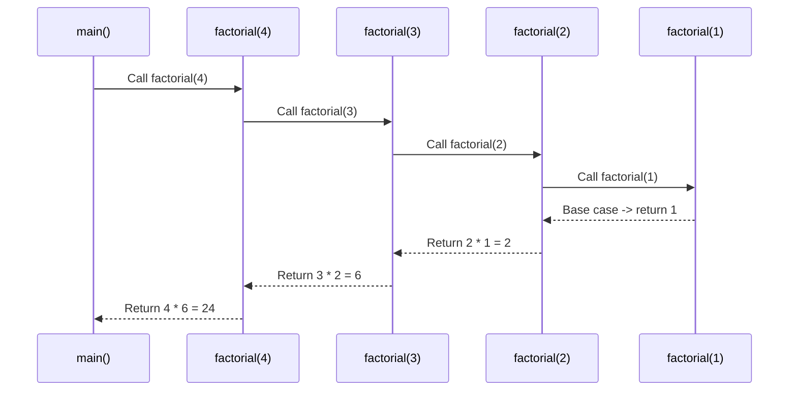
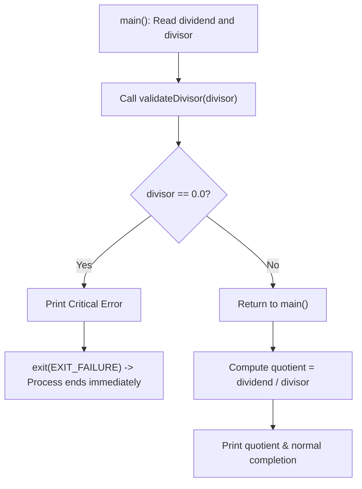

# Recursion Call Stack & `exit()` Flow (Lab 8)

## 1. Recursive Factorial Call Stack for `factorial(4)` (Q.15)

```mermaid
sequenceDiagram
    participant Main as main()
    participant F4 as factorial(4)
    participant F3 as factorial(3)
    participant F2 as factorial(2)
    participant F1 as factorial(1)

    Main->>F4: Call factorial(4)
    F4->>F3: Call factorial(3)
    F3->>F2: Call factorial(2)
    F2->>F1: Call factorial(1)
    F1-->>F2: Base case -> return 1
    F2-->>F3: Return 2 * 1 = 2
    F3-->>F4: Return 3 * 2 = 6
    F4-->>Main: Return 4 * 6 = 24
```

---

## 2. Immediate Termination Using `exit()` (Q.16)

```mermaid
flowchart TD
    A["main(): Read dividend and divisor"] --> B["Call validateDivisor(divisor)"]
    B --> C{"divisor == 0.0?"}
    C -- Yes --> D["Print Critical Error"]
    D --> E["exit(EXIT_FAILURE) -> Process ends immediately"]
    C -- No --> F["Return to main()"]
    F --> G["Compute quotient = dividend / divisor"]
    G --> H["Print quotient & normal completion"]
```
